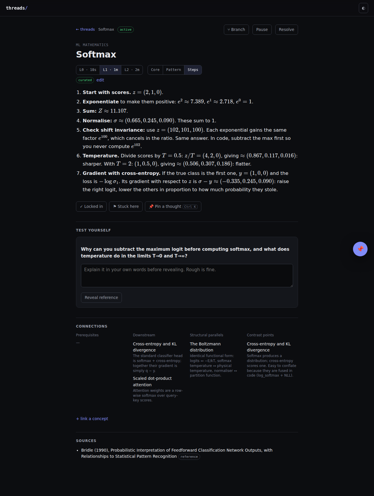
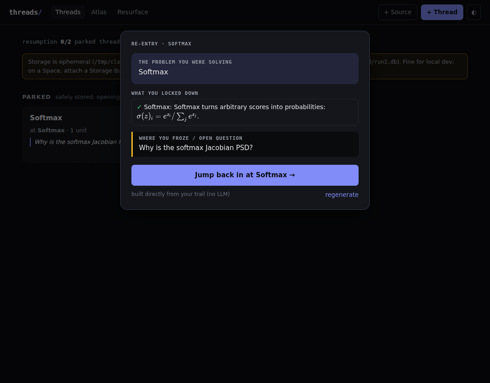

# threads/ — a thread-resilient learning engine

Microlearning for associative minds. Instead of a queue of summaries and a streak to protect, you get a **graph of concepts** and **threads of curiosity** that you can branch, park and resume without paying a re-entry tax.

- **Fractal depth:** every concept has L0 (30-second hook), L1 (3-minute anatomy) and L2 (deep dive).
- **Two lenses:** an orthogonal switch at any depth. **Pattern** gives shape, invariants and cross-domain parallels. **Steps** builds from definitions with a worked example. **Core** is the balanced version.
- **Branch, don't abandon:** pivot from any concept into a child thread. The parent is checkpointed and you can record *why* you pivoted.
- **Resumption primers:** a thread idle for 7+ days is *parked*. Opening it never drops you into long-form text. You first get a 30-second reload: the problem you were solving, what you locked down, and where you froze.
- **Drop-pins (Ctrl+K):** capture an open loop in one sentence without leaving the page. Pins feed the primers.
- **Active recall, without guilt:** each concept carries a recall question. *Resurface* shows what is ready on an expanding schedule. There are no overdue counts and no streaks.
- **Grounded sources:** add concepts from Wikipedia, arXiv, any web page or pasted text. The source text is stored with the concept so later synthesis is grounded in it. Every layer shows its **provenance**: `curated`, `extracted` or `synthesised` (LLM-written, verify before trusting).

Seeded with a cross-linked slice of ML maths: backprop, gradient descent and conditioning, softmax, entropy, cross-entropy/KL, the Boltzmann distribution, attention and SVD.

See [`docs/DESIGN.md`](docs/DESIGN.md) for the rationale, and for where this build departs from the original spec and why.

## Run locally

```bash
pip install -r requirements.txt
uvicorn app.main:app --reload --port 7860
# open http://localhost:7860
```

LLM features (synthesising layers, primers, recall questions, smart ingest) need `HF_TOKEN` or `OPENROUTER_API_KEY`. Without a token everything else works, and primers/ingest fall back to deterministic versions.

```bash
pip install pytest && python -m pytest -q
```

## Deploy to Hugging Face Spaces

Live Space: https://huggingface.co/spaces/SoulFireMage/threads (private).

1. **The Space holds only two files**: `space/Dockerfile` (as `Dockerfile`) and a short README card. The Dockerfile downloads a **pinned commit** of this GitHub repo at build time, so nothing binary has to be uploaded to the Space.
2. **To deploy a new version**, push to GitHub, then change `REF` in the Space's `Dockerfile` to the new commit SHA. Each deploy is an exact, reproducible commit.
3. **Persistence**: HF Spaces now persist data through **Storage Buckets** mounted as volumes. Create a private bucket (`hf buckets create <you>/threads-data --private`) and attach it in *Space Settings → Storage Buckets* at mount path **`/data`**. The app detects `/data` and stores `app.db` there. Without it, data is lost on restart, and the home page will warn you.
4. **Secrets** (*Settings → Variables and secrets*):

| Name | Required | Purpose |
|---|---|---|
| `HF_TOKEN` | for LLM features (or OpenRouter below) | Token with *Inference Providers* permission |
| `OPENROUTER_API_KEY` | alternative LLM backend | Takes precedence over `HF_TOKEN` when set. A budget-capped, expiring key is ideal |
| `OPENROUTER_MODEL` | no | Default `qwen/qwen3.8-27b` |
| `LLM_BACKEND` | no | `auto` (default), `hf` or `openrouter` |
| `LLM_REASONING` | no | Reasoning effort for deep-dive synthesis: `off`, `low` (default), `medium`, `high`. JSON tasks (primers, ingest, recall questions) always run with reasoning off |
| `WIKIMEDIA_TOKEN` | no | Personal API token from api.wikimedia.org. Wikipedia throttles shared cloud IPs; authenticated requests get per-account limits |
| `DEFAULT_MODEL` | no | Default `Qwen/Qwen3.8-27B`; any chat model served by HF Inference Providers |
| `INFERENCE_PROVIDER` | no | Default `auto` |
| `APP_PASSWORD` | if the Space is public | Enables a password gate |
| `APP_SECRET` | with `APP_PASSWORD` | Random string used to sign the session cookie |
| `DORMANCY_DAYS` | no | Default `7` |
| `MAX_ACTIVE_THREADS` | no | Default `2` |
| `SQLITE_JOURNAL_MODE` | no | Default `WAL` locally, `DELETE` on `/data` (bucket mounts are object storage; see design notes) |

`GET /api/export` downloads everything as JSON. Take one now and then; it costs nothing.

## Layout

```
app/
  main.py      FastAPI routes, auth, streaming expansion
  state.py     thread state machine (+ lazy dormancy sweep, metrics)
  services.py  units, progress, pins, primers, ingest, recall
  llm.py       InferenceClient wrapper, prompts, <think> filtering, JSON extraction
  sources.py   Wikipedia / arXiv / URL / text fetchers
  seed.py      curated ML-maths seed graph
  db.py        SQLite schema and connections
static/        single-page UI (vanilla JS; marked, DOMPurify, KaTeX vendored)
tests/         pytest suite (state machine, API flows, LLM paths mocked, parsers)
```

## Screenshots

| Reader (L1, Steps lens) | Resumption primer |
|---|---|
|  |  |
